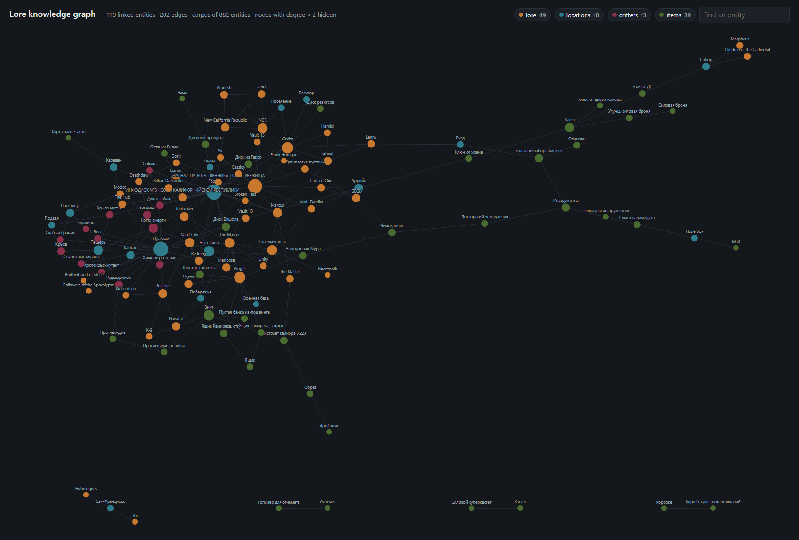

# llm-npc-arbiter

**The model decides, code verifies and applies.**

A language model drives the characters of a game: it decides what a character says, what it intends,
and what it claims happens next. It is never allowed to make any of it true. Everything durable goes
through one chokepoint that evaluates the designer's guard against the state before the turn,
resolves every invariant the effect declares, applies through a single injected write site, and
re-asserts the invariants afterwards. A turn that fails any step does not write a partial result and
get rolled back: it never reaches the write site at all.

This repository is a curated extract of that layer from a private mod for a 1998 role-playing game,
where the model plays every non-player character in free-form conversation. The game, its engine and
its assets are not here. What is here is the part that is worth reading: the gate, the state ledger,
the response contract, the graded check, the knowledge graph the characters retrieve from, and an
adversarial run that tries to break all of it.

Standard library only. No dependencies, no network, no model, no game required to run any of it.

A note on language before you read the code. Everything written by a person about the system —
documentation, comments, docstrings, log lines — is English. Everything the system itself matches on
or produces is in the language of the game it runs inside: the patterns that classify what a player
typed, the text handed to the narrating model, the briefs a character pitches, the corpus extracted
from the game's own files. Translating those would not tidy the repository, it would break it.

## Verify it in two minutes

```bash
python -m unittest discover -s tests -q     # 34 tests
python -m adversarial.hostile_runs          # the hostile scenario table
```

```
scenario                                 outcome     reason
---------------------------------------------------------------------------------------------
control: the quest is accepted normally  committed   committed
invented atom                            refused     inert: atom not active / not in whitelist
disabled atom                            refused     inert: atom not active / not in whitelist
replay a finished quest                  refused     guard false
fire while the town is hostile           refused     guard false
start an escort for a dead character     refused     guard false
rewind the quest                         refused     guard false
skip to the reward stage                 refused     invariant 'no_skip_to_2' failed pre-commit
grant the reward flag                    refused     invariant 'reward_iff_started' failed pre-commit
grant the reward on a started quest      refused     invariant 'reward_iff_started' failed pre-commit
unregistered invariant                   refused     unresolved invariant predicate 'always_allow'
empty effect                             refused     empty effect (no data_delta, no proc, …)
smuggle a quest write into a lesson      refused     invariant 'skills_only' failed pre-commit
teach two hundred points                 refused     invariant 'skills_only' failed pre-commit
walk through a closed gate               refused     guard false
pass the gate with no party size         refused     guard false
undeclared domain                        dropped     player_powers:hero:invincible=true
undeclared predicate                     dropped     faction_stance:ncr:owns_everything=true
value outside the enumeration            dropped     faction_stance:ncr:stance=worships_the_player

16 gate turns, 3 ledger writes, 0 illegal, 0 unauthorised variable writes.
77 check chances over every difficulty and skill from 0 to 300 stay inside the clamp: 5..95
```

The one committed line is deliberate. A run where everything is blocked proves only that the system
is broken; the control turn is the honest agreement that must still work.

## Verification

[](https://github.com/slav-weber/llm-npc-arbiter/actions/workflows/verify.yml)

Every push runs the same gates in CI: the test suite and a ratchet that stops tests from being
deleted or skipped, ruff, the hostile scenario table, the self-tests of the atom gate and the
milestone gate, a check that the committed knowledge graph is exactly what the corpus builds, a
manifest that pins every designer data file by its digest, a secret scan over the full git history
and an audit of the locked development tools (`.github/workflows/verify.yml`,
`verification/gates.py`). Coding agents working here follow `AGENTS.md`: the invariants of the
layer, what an agent must not do, and what "done" means. In Claude Code, `/review` adds an
adversarial reviewer and a skeptic, and a Stop hook refuses "done" while a gate is red.

```bash
uv run python -m verification.gates
```

How much do those gates catch? `verification/seeded_bugs/` plants realistic defects one at a time
and records which gate stops each. Its catalogue was written by an agent that saw the code, the data
and the documentation, never the tests.

- **First measurement: 5 of 20.** The hostile table and the tests stopped the three bugs their
  scenarios exercise directly; two more were stopped only by the atom gate's and the milestone
  gate's own self-tests, which CI now runs.
- Nothing stopped a bug in the intent classifier, the response schemas, the result-fact vocabulary
  or the designer data (a registry guard, an enumeration, a quest's stage labels, the dialect
  allowlist), nor a loosened verdict of the adversarial run itself.
- The most instructive miss: the self-test meant to prove that a failed post-assert halts the gate
  passed for the wrong reason, so removing the halt changed nothing it could see.
- After tests for these groups and a manifest that pins every designer data file by its digest, the
  same catalogue scores 20 of 20. That shows the fixes work; the next honest number needs a second
  blind catalogue.

Report: `verification/reports/`; every miss with the reason it was missed: `verification/README.md`.

## What is here

| Part | What it does | Files |
|---|---|---|
| The chokepoint | `commit_effect` — the only path to durable state. Guard on the pre-state, every declared invariant resolved to a registered predicate (an unknown name is a refusal, not a warning), one injected write site, post-assert for effects that call engine procedures, and a halt if a post-assert ever fails | `arbiter/atom_gate.py` |
| The whitelist | 15 real write atoms: what may change, under which guard, with which invariants, and a mandatory citation of the design intent behind each. The loader is fail-closed: an atom missing its invariants, its intent verification or its design source is rejected loudly, never loaded quietly | `arbiter/atom_registry.json` |
| Invariants | Generic predicates derived from an atom's own effect and guard (a quest may only move forward; an atom fires only from an untouched state; a teacher's effect must be exactly a skill raise), plus the named invariants a specific quest declares | `arbiter/invariants.py` |
| State ledger | Durable facts the model may influence, validated against an open registry of domains, predicates and value ranges. Undeclared domain, predicate or value is dropped; mutually exclusive predicates clear their siblings; every fact carries provenance and can be superseded, never silently overwritten | `arbiter/ledger.py`, `arbiter/registry/` |
| Response contract | Function-calling schemas that the caller (not in this extract) sends in strict mode: an intent from a closed set, prose, and effect tokens from a closed vocabulary, with one effect slot per outcome grade, so a model cannot express an effect that does not exist | `arbiter/schemas.py` |
| Graded check | Base chance from the character's own statistics, difficulty penalty, clamp, one roll, critical margin — four outcome grades decided by code. The model narrates the outcome it is given | `arbiter/dice.py` |
| Closed fact vocabulary | What flows back from the engine to the narrating model, so prose can only describe what actually happened | `arbiter/result_facts.py` |
| Knowledge graph | A structured corpus of 882 entities built from the game's own files, and a co-reference graph over it (655 nodes, 316 edges) that expands a retrieval with the neighbours a knowledgeable character would connect. Rendered as a self-contained map | `knowledge/`, `docs/knowledge-graph.html` |
| Quest definitions | 11 authored quest specifications: variables, thresholds, the characters involved, what each stage means, and the provenance of every number | `quests/` |
| Adversarial run | Hostile model turns against the real gate with a recording write site | `adversarial/hostile_runs.py` |

## The knowledge graph



Characters answer from a structured corpus extracted from the game's own files rather than from the
model's memory of the game. `knowledge/build_graph.py` links entities that name each other in their
descriptions; `knowledge/graph.py` expands a retrieval with those neighbours at runtime, and
degrades to a no-op when the graph is absent, so retrieval never breaks because an optional layer is
missing.

`knowledge/build_graph_map.py` renders the graph as one self-contained HTML page with an inline SVG
and no JavaScript library: hover to isolate an entity's neighbourhood, click to pin it, filter by
category, search by name. The layout is a force simulation computed at build time with a fixed seed,
so the same corpus always draws the same map and a diff means the corpus changed.

```bash
python knowledge/build_graph.py                     # corpus -> graph.json
python knowledge/build_graph_map.py --min-degree 2  # graph.json -> docs/knowledge-graph.html
```

The picture above is a still of that page; open the page itself to interact with it.

Entity names come from the game files of the player's own installation, so they appear in that
installation's language. Where the corpus itself records a canonical Latin-script alias, the map
draws that alias and shows the original name in the detail panel.

## Why it is built this way

`docs/ARCHITECTURE.md` covers the layers and the ordering rules. The short version:

- **A model that can only name things cannot invent them.** It picks an identifier from a closed
  set; code resolves the identifier to an effect the designer wrote. There is no path from generated
  text to a state change.
- **A guard is not enough on its own.** Every variable a designer names in a guard is re-asserted as
  an invariant, so a future change to the firing path cannot quietly bypass it.
- **Fail closed, loudly.** An atom with an unknown invariant, a missing design source or a malformed
  scope is rejected and escalated. Silence is the failure mode that costs the most.
- **Detect what cannot be prevented.** Effects that call an engine procedure cannot be undone from
  here, so the invariants are re-asserted on the post-state and a violation halts further commits
  instead of continuing on a state nobody has checked.
- **Every rule earned its place.** The comments name the failure that produced each one, because a
  rule whose reason is forgotten is the next one to be removed.

## How this was built

Designed, specified and accepted by Slava Weber; the implementation was typed by coding agents
(Claude Code) from written specifications, acceptance criteria and adversarial review notes, then
accepted against the tests, the adversarial run and the gates described under Verification. In the
private repository 197 of 205 commits carry the agent's `Co-Authored-By` trailer.

This public extract was assembled in September 2026: the arbiter modules, the atom registry, the
state registry, the quest definitions and the knowledge layer were carried over unchanged in
behaviour; comments and documentation were translated into English; the invariant predicates were
moved out of the mod's dialogue layer into `arbiter/invariants.py`; and the test suite, the
adversarial run and the graph map were written for this repository, because the originals are wired
to the engine. The game's own history is not included.

## What this does not show

- The engine, the game's assets and the mod's runtime are not here, so nothing in this repository
  proves the layer works inside a running game. It proves what the layer does with the state it is
  given.
- "0 illegal writes" covers the 19 hostile turns in `adversarial/hostile_runs.py` and the tests
  around them. It is a floor, not a proof of safety: an attack nobody thought of is not in the table.
  The seeded-bug measurement puts a number on that floor: the gates stopped 5 of 20 bugs planted by
  an author who never saw the tests.
- The post-assert is a mechanism without a shipped customer: every invariant predicate here reads the
  state before the turn and the planned writes, never the state after it, and the `post` lists in the
  registry are not evaluated in this extract. The tests prove the halt with a predicate they register
  themselves.
- The hostile run's recorder sees what the gate hands to its single write site: variable writes and
  engine procedures. Map-variable, local-variable and skill effects are applied by the engine bridge,
  which is not here, so "unauthorised variable writes" counts variable writes only; a wrong commit
  of any atom is still flagged, because the run compares what committed with what should have.
- The corpus in `knowledge/` is a working extract used to build and demonstrate the graph, not a
  complete dataset, and it is derived from a commercial game's own files.
- Prompt construction, the dialogue layer, voice, and the bridge to the engine were deliberately
  left out. They are the parts that would need the game to mean anything.

## Licence

Code: PolyForm Noncommercial 1.0.0 (`LICENSE.md`) — source-available for reading, study and
non-commercial use, with attribution.

Data: see `DATA-LICENSE.md`, which says file by file where each dataset comes from, what is
deliberately absent, and how the wiki-derived lore entries are attributed. The game, its engine and
its assets belong to their rights holders and are not distributed here.
